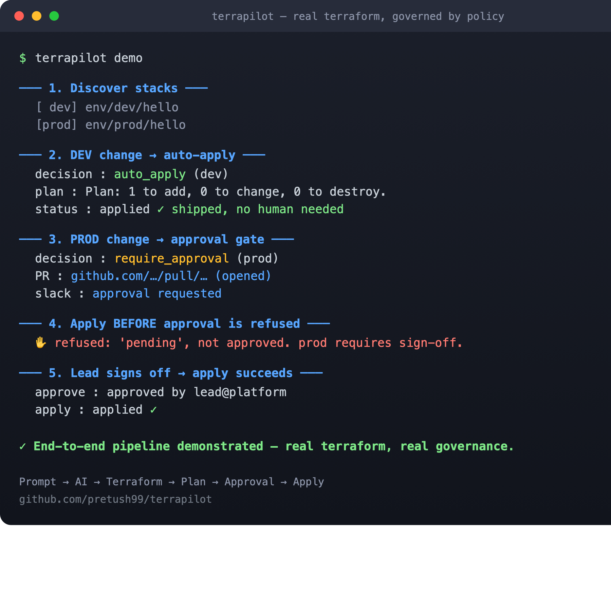

# 🛰️ TerraPilot

**An AI-native, policy-governed Terraform automation server — the in-house Atlantis, driven over MCP.**

TerraPilot lets an AI assistant (Claude, via the [Model Context Protocol](https://modelcontextprotocol.io)) take a natural-language request and turn it into a *safe, governed* infrastructure change:

```
Prompt  →  AI  →  Terraform  →  Plan  →  Approval  →  Apply
```



The catch every team hits with raw AI + Terraform is **trust**: who lets the model run `apply`? TerraPilot answers that with a non-bypassable policy engine:

| Environment | Behaviour |
|-------------|-----------|
| **dev**  | validate → plan → policy → **auto-apply** (it just ships) |
| **prod** | validate → plan → policy → **open a GitHub PR + Slack approval** → lead sign-off → apply |
| **any**  | destroying a protected resource, or a protected path, **escalates to a human or is blocked** |

---

## Architecture

```
                         ┌──────────────────────────────────────────────┐
   Claude / any MCP      │                  TerraPilot                   │
   client                │                                               │
        │   MCP (stdio)  │   server.py  ── FastMCP tools                 │
        └───────────────▶│      │                                        │
                         │      ▼                                        │
                         │   engine.py  (orchestrator)                   │
                         │      │                                        │
                         │      ├─ discovery   ── reads atlantis-*.yaml   │
                         │      ├─ runner      ── terraform plan/apply ───┼──▶ AWS / S3 state
                         │      │                 (+ mock mode)           │
                         │      ├─ policy      ── env + guardrails        │
                         │      ├─ store       ── change requests         │
                         │      ├─ github      ── PR w/ plan (gh) ────────┼──▶ GitHub
                         │      └─ slack       ── approval message ───────┼──▶ Slack
                         │                                               │
                         │   audit.jsonl  ── append-only trail            │
                         └──────────────────────────────────────────────┘
```

The plan/apply boundary is hash-pinned: `apply` only ever runs a **saved plan whose SHA-256 matches** what policy approved — closing the gap between "what was reviewed" and "what runs".

---

## Quickstart (one-time deploy)

```bash
git clone https://github.com/pretush99/terrapilot.git && cd terrapilot
./bootstrap.sh
```

`bootstrap.sh` finds Python ≥ 3.10, creates a virtualenv, installs TerraPilot, writes `config.yaml`, self-tests, and prints the snippet to register the MCP server. Then:

```bash
# Register with Claude Code
claude mcp add terrapilot -- "$(pwd)/.venv/bin/python" -m terrapilot.server

# See it run end-to-end immediately (mock mode, no AWS needed)
make demo
```

### Run it for real — no cloud, no credentials

TerraPilot ships with a **real** (cloud-free) example under `examples/real-repo` that uses the `hashicorp/local` provider and a local backend. This runs genuine `terraform init/plan/apply` — proving the engine is real, not mocked:

```bash
TERRAPILOT_REPO_PATH="$(pwd)/examples/real-repo" \
TERRAPILOT_MOCK_MODE=false \
TERRAPILOT_STATE_DIR=/tmp/tp-real \
.venv/bin/python -m terrapilot.cli demo
```

You'll watch a **dev** stack auto-apply and write a real file, a **prod** stack get refused until approved, then apply after sign-off. Swap the example's `local_file` for your real cloud resources and point `repo_path` at your IaC repo to go live.

Point it at your Terraform repo and pick real vs mock in `config.yaml`:

```yaml
repo_path: "/path/to/your/iac-repo"
aws_profile: "default"
mock_mode: true     # flip to false for real plans/applies
```

---

## MCP tools

| Tool | Purpose |
|------|---------|
| `list_stacks` | Discover stacks (from `atlantis-*.yaml`), filter by env/substring |
| `describe_stack` | Show a stack's env, backend and governing policy |
| `validate_stack` | `terraform fmt` + `validate` (offline-safe) |
| `plan_stack` | Read-only plan + policy decision preview |
| `propose_change` | **The pipeline**: validate → plan → policy → auto-apply (dev) or approval (prod) |
| `approve_change` | Lead sign-off on a pending prod request |
| `apply_change` | Apply an *approved*, hash-verified plan |
| `list_requests` / `audit_log` | Inspect change requests and the audit trail |

A typical Claude conversation: *"Plan the change to the dev dynamodb stack and ship it if it's safe."* → Claude calls `propose_change`, sees `auto_apply`, and it's deployed. For prod, Claude reports the PR + Slack request and waits.

---

## The `demo`

`make demo` runs the full pipeline against the configured repo (mock mode, or real with the env vars above):

1. **Discover** stacks from the existing Atlantis config
2. **Dev** change → auto-applied
3. **Prod** change → PR opened + Slack drafted, returns a `request_id`
4. **Apply before approval → refused** ✋
5. **Lead approves → apply succeeds** ✅
6. **Audit trail** printed

---

## Best practices baked in

- **Human-in-the-loop for prod is non-bypassable** — enforced in `apply_change`, not by convention.
- **Plan/apply separation with hash pinning** — no TOCTOU drift between approve and apply.
- **Least privilege & no secrets in code** — AWS via profile/env, tokens never logged, state/plan files git-ignored.
- **Destroy & protected-resource guardrails** — destroying an RDS/S3/KMS/EKS resource is blocked; protected paths escalate to manual.
- **Single-use, expiring approval tokens** bound to the plan hash.
- **Full audit trail** (append-only) for every action.
- **Native locking** via the repo's existing S3 lockfile / DynamoDB locks.
- **Mock mode** for safe demos, CI, and offline development.
- **Mirrors the team's existing Atlantis project layout** — zero migration of how stacks are defined.

---

## Configuration

All settings live in `config.yaml` (see `config.example.yaml`) and can be overridden by `TERRAPILOT_*` env vars. Governance lives in `policy.yaml`: environment matching, auto-apply rules, approvers, and guardrails (max destroys, protected paths, protected resource types).

---

## Testing

```bash
make test    # end-to-end tests drive the real MCP tools via FastMCP's in-memory client
```

The suite runs against the bundled synthetic repo (`tests/fixtures/repo`) in mock mode — exercising discovery, the policy engine, the prod approval gate, and the guardrails without touching AWS. Point `TERRAPILOT_REPO_PATH` at a real repo to run the same flow there.

---

## Roadmap: POC → production

Phase 1 is **working today** — local stdio, runs real terraform with your creds. It's architected to graduate:

- **Phase 2 (hosted):** containerize, run as a remote MCP/HTTP server on EKS with an IAM role; replace the JSON store with Postgres; OIDC auth per user.
- **Phase 3 (enterprise):** real Slack interactive buttons, CODEOWNERS-enforced merge → apply via webhook, OPA/Conftest policy packs, cost estimation (Infracost), drift detection.

---

_Built to replace the Atlantis hustle with something AI-native, governed, and boringly safe._
